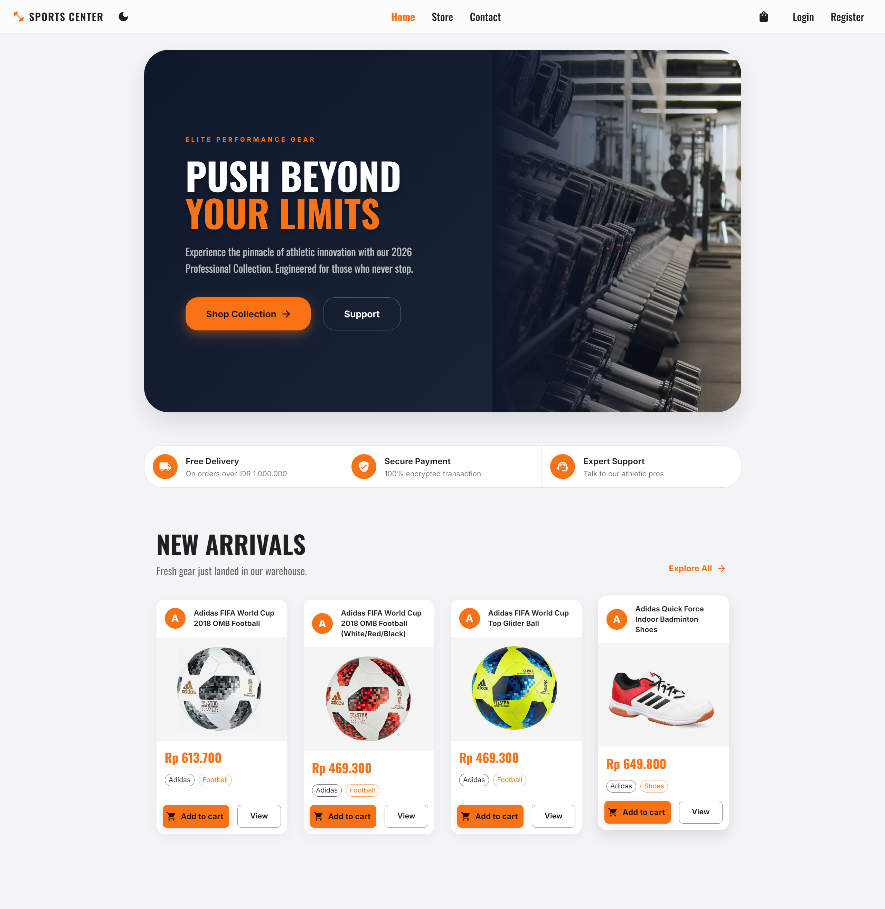
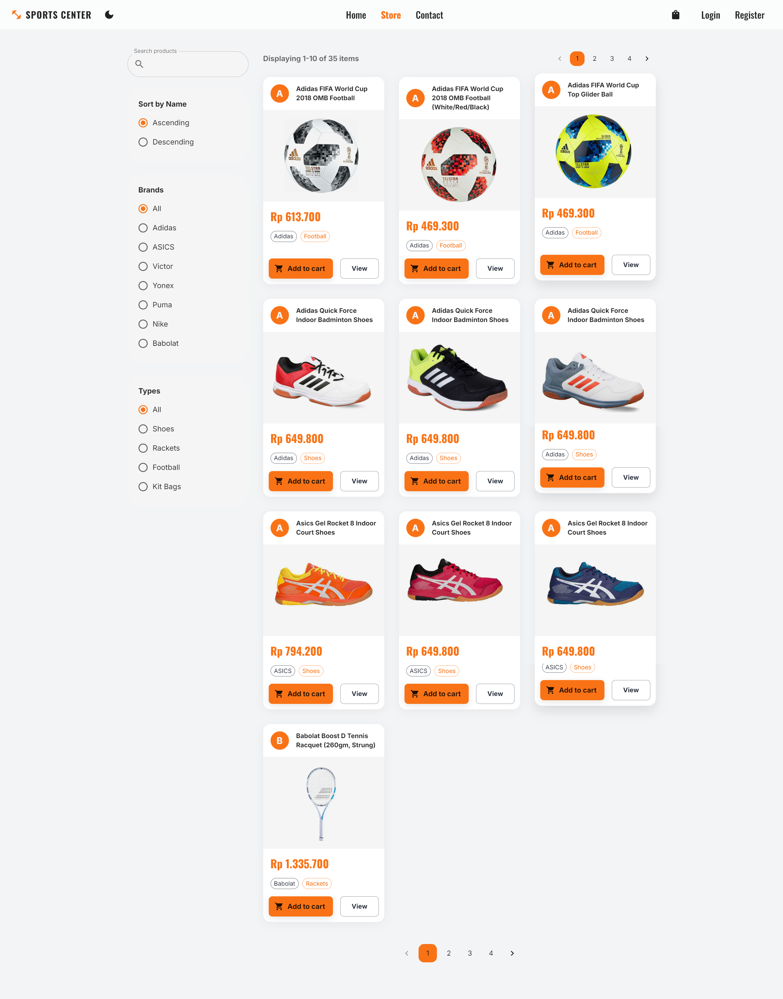
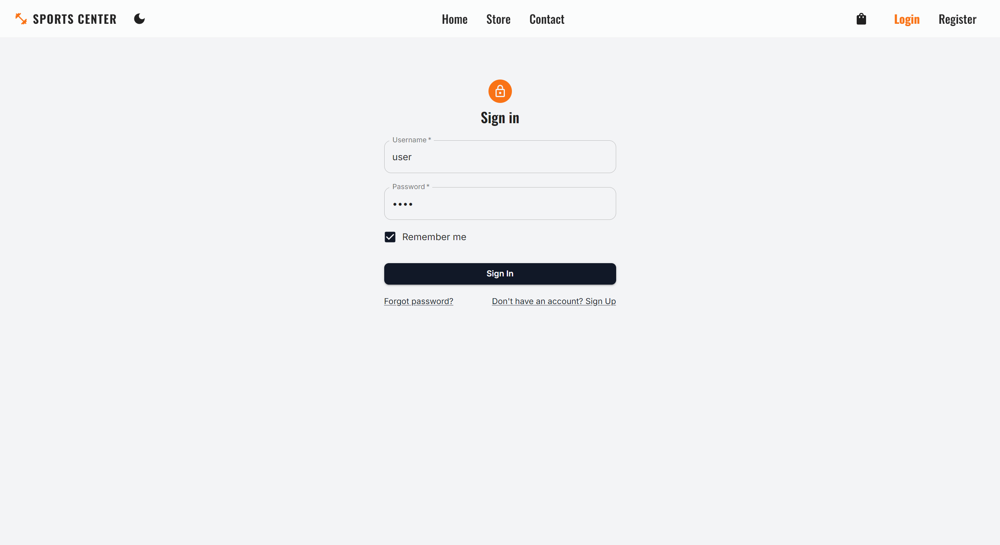
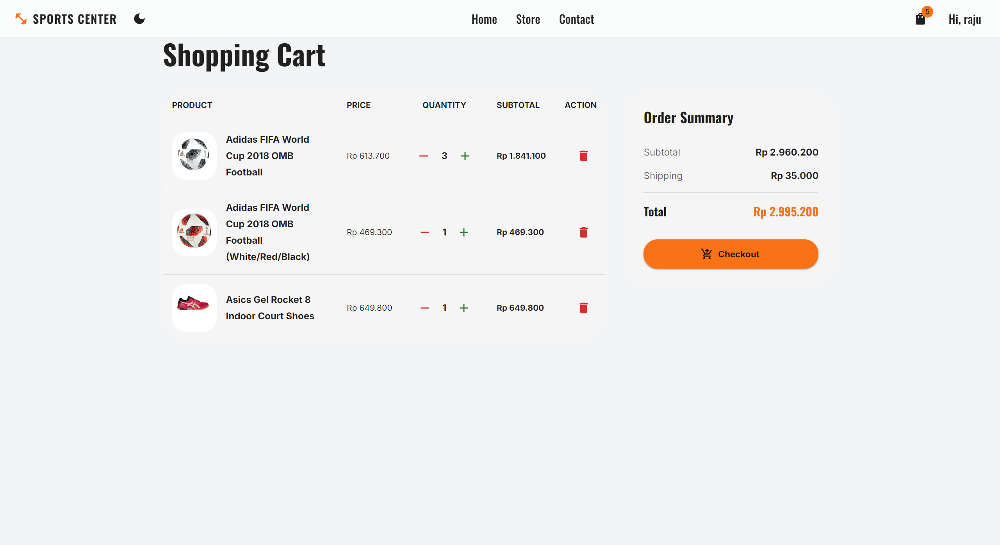
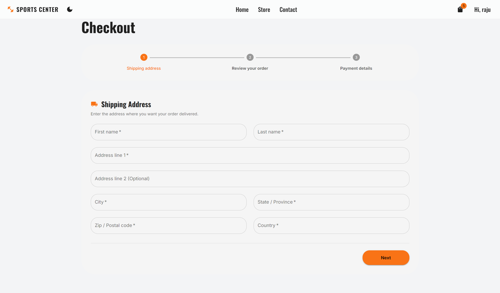
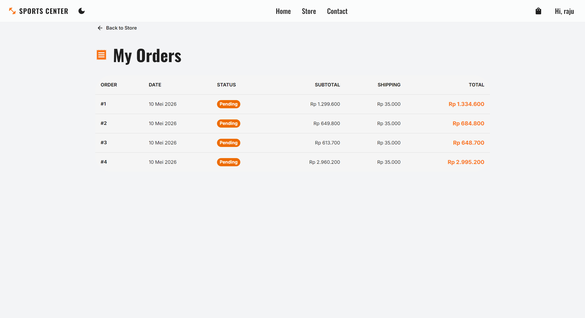

# 🏆 SportsCenter: Elite E-Commerce Platform

[](https://spring.io/projects/spring-boot)
[](https://reactjs.org/)
[](https://mui.com/)
[](https://jwt.io/)
[](https://www.mysql.com/)

**SportsCenter** is a premium, high-performance e-commerce application designed for professional athletes and sports enthusiasts. Built with a robust **Java Spring Boot** backend and a sleek, responsive **React** frontend, this project demonstrates industry-standard practices in full-stack development, security, and UI/UX design.

---

## 📸 Project Showcases

<details>
<summary><b>Click to expand screenshots</b></summary>

### 🏠 Home Page (Premium Hero Section)


### 🛒 Product Catalog (Filtering & Sorting)


### 🔑 Secure Authentication


### 🛍️ Shopping Basket


### 💳 Modern Checkout Flow


### 📋 Order History

</details>

---

## 🚀 Key Features

### 💻 Frontend (React + TypeScript)
- **Premium UI/UX**: Built with Material UI (MUI) following modern design principles (Glassmorphism, Dark Mode, Micro-animations).
- **State Management**: Fully powered by **Redux Toolkit** for predictable state changes and efficient basket handling.
- **Dynamic Catalog**: Real-time filtering, sorting, and pagination for thousands of products.
- **Responsive Design**: Seamless experience across mobile, tablet, and desktop devices.
- **Form Handling**: Complex validation using **React Hook Form** and **Yup**.
- **Secure Routing**: Protected routes for checkout and order history using React Router.

### ⚙️ Backend (Spring Boot + Java)
- **RESTful API**: Clean and scalable API architecture following SOLID principles.
- **Security**: Robust authentication and authorization using **Spring Security** and **JWT (JSON Web Tokens)**.
- **Data Persistence**: **Spring Data JPA** with **MySQL** for reliable data storage.
- **Caching**: Integrated **Redis** for high-performance session and basket management.
- **API Documentation**: Automated documentation with **SpringDoc OpenAPI (Swagger)**.
- **Mapping**: Optimized DTO mapping using **MapStruct**.
- **Clean Code**: Leveraging **Lombok** to reduce boilerplate and improve readability.

---

## 🛠️ Tech Stack

### Frontend
- **Framework**: React 18 (Vite)
- **Language**: TypeScript
- **Styling**: Material UI (MUI) 5
- **State**: Redux Toolkit
- **Routing**: React Router 7
- **Networking**: Axios

### Backend
- **Language**: Java 25
- **Framework**: Spring Boot 4.0.6
- **Security**: Spring Security + JWT
- **Database**: MySQL 8
- **Cache**: Redis
- **Documentation**: Swagger UI / OpenAPI 3

---

## 🏁 Getting Started

### Prerequisites
- **Node.js** (v18+)
- **Java JDK** (v25+)
- **MySQL**
- **Redis**

### Setup Backend
1. Configure your MySQL database in `src/main/resources/application.properties`.
2. Run the Spring Boot application:
   ```bash
   ./mvnw spring-boot:run
   ```

### Setup Frontend
1. Navigate to the client directory:
   ```bash
   cd client
   ```
2. Install dependencies:
   ```bash
   npm install
   ```
3. Start the development server:
   ```bash
   npm start
   ```

---

## 👨‍💻 Author
**Raju Putra** - *Full Stack Developer*
[GitHub](https://github.com/rajuputra) | [LinkedIn](YOUR_LINKEDIN_URL)

---
*Developed with passion for the sports community.*
